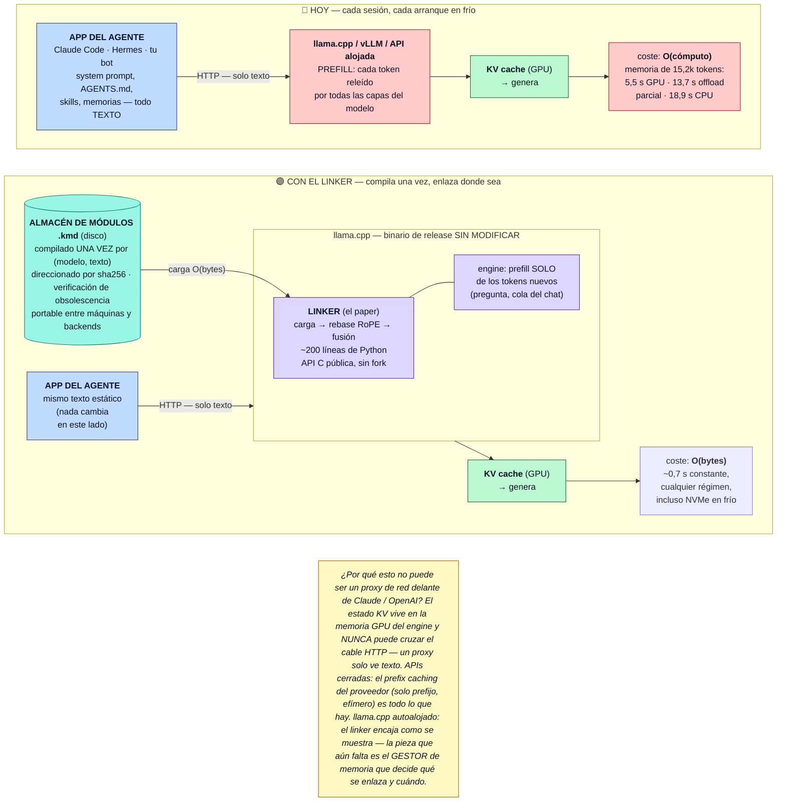

# kv-memory-modules — módulos de memoria KV precompilados para runtimes de LLM

*(English version: [`README.md`](README.md))*

Prueba de concepto de investigación: **compila las memorias Markdown de un agente en
módulos de KV-cache reutilizables** (`.kmd`) y enlázalos en un contexto vivo en
milisegundos, en lugar de re-prefillear miles de tokens en cada sesión.



*Dónde encaja dentro del runtime (versión estática: [`docs/diagram.jpg`](docs/diagram.jpg)).
Para el diseño completo de gestión de memoria —carga dinámica por tool-call y descarga por
eviction estilo Redis cuando se agota el presupuesto de contexto— ver
[`docs/ARCHITECTURE.es.md`](docs/ARCHITECTURE.es.md).*

Esto es una **implementación en llama.cpp de módulos KV relocalizables para enlazado
no-prefijo**; los experimentos en vLLM validan la restauración de estado en prefijo y
motivan una extensión de conector interoperable — **no** son un linker funcional en
vLLM (ver la matriz de capacidades abajo). Piénsalo como un linker para el contexto: el
fichero Markdown es el código fuente, `mdc` es el compilador, el blob `.kmd` es el
fichero objeto, y el runtime de llama.cpp lo enlaza — en el prefijo del prompt (caso
trivial) o en una posición arbitraria mediante rebase RoPE por software — incluyendo
modelos híbridos de atención/recurrencia (Qwen3.5 / Gated DeltaNet).

## Qué se demuestra (y qué no)

Las capacidades se validan sobre **llama.cpp**; vLLM es un segundo runtime,
arquitectónicamente no relacionado, que usamos para comprobar si el *contrato* de
precompilar/restaurar se transfiere.

| Capacidad | llama.cpp | vLLM |
|---|---|---|
| Restauración de estado en prefijo | **Validado** (§5.1) | **Validado** (E9, §6.4) |
| Enlazado no-prefijo (posición arbitraria) | **Validado** (§5.2–5.7) | *Propuesto* — necesita un conector + extensión del contrato del scheduler (§6.4) |
| Módulos híbridos GDN | **Validado** (§5.5) | *Bloqueado* por la unificación de KV-spec del conector actual (E19) |
| KV de cabezal draft MTP | **Validado con un parche de ~120 líneas** (§5.8) | Especulación MTP base validada; la vía híbrido + conector está bloqueada (E19) |

La **paridad de recall** con el prefill completo se establece con test estadístico
pareado sobre corpus con hechos inyectados (preguntas respondibles solo desde los hechos
sintéticos inyectados, nunca desde conocimiento paramétrico): la inserción de un solo
módulo no muestra **diferencia estadísticamente detectable** (McNemar exacto *p*=0,69,
IC 95 % del déficit [−1,7, +3,1] pp, N=420); un workspace de tres módulos y 33k tokens
alcanza la paridad (*p*=1,0, N=120); el único hueco real — atribución multi-módulo
(*p*<0,001, N=140) — se reduce recomputando con splice-k y cierra a paridad a escala de
workspace. Reproducible con `python experiments/stats_recall.py` (offline, sin GPU).
Mapa completo afirmación→evidencia en [`docs/EVIDENCE.es.md`](docs/EVIDENCE.es.md).

Cifras cabecera de coste de arranque (la ventaja crece donde el cómputo escasea):

| Escenario | Prefill | Restore | Aceleración |
|---|---|---|---|
| memoria 15k tokens, 7B, solo CPU (20 núcleos) | 18,9 s | 0,69 s | ×27,6 |
| memoria 15k tokens, 7B, RTX 4070 Ti SUPER | 5,5 s | 0,78 s | ×7,0 |
| memoria 5,1k tokens, 4B, portátil Arc 140V (Vulkan) | 12,1 s | 1,7 s | ×7,1 |

Las filas del 7B son medianas de N=5 ejecuciones con un restore en **frío** (`.kmd`
expulsado de la page cache del SO antes de cada lectura); la dispersión del prefill es
<3 % y la del restore frío <2 % (E12, §5.6).

Son ratios de **coste de arranque** (prefill vs. restore, §5.2/§5.6). El **TTFT** de
arranque en frío (restore+consulta vs. prefill completo) para una memoria de 1,4k tokens
en el mismo portátil es ×8,4 en CPU y ×4,3 en la GPU Arc/Vulkan (§5.1).

## Límites operativos (leer antes de confiar en esto)

- **Los módulos pesan**: f16 ≈ 147 KB/token para un modelo 4B con GQA (~36 000× el texto
  fuente); un módulo de 51,8k tokens son ~7,6 GB en f16. **q8_0 es la política por
  defecto** (la mitad del tamaño, sin coste de comportamiento en nuestra carga); los
  dtypes por debajo de q8 colapsan silenciosamente en ciertas combinaciones
  modelo×longitud a partir de ~9k tokens — validar antes de usar.
- **La selección de página no se evalúa de punta a punta**: el resultado de lectura
  paginada (§6.7) usa una tabla de páginas oráculo determinista; un selector real añade
  su propio error y latencia, y la economía completa (compilación, almacenamiento,
  punto de equilibrio frente a recuperación de texto) es trabajo futuro.
- **El MTP relocalizable no está hecho**: los módulos MTP se restauran en sus posiciones
  de compilación (§5.8); el rebase del KV draft a una posición arbitraria es trabajo
  futuro.
- **Solo dos runtimes**: llama.cpp (y sus envoltorios Ollama / LM Studio / llamafile,
  que heredan el mecanismo) y vLLM (solo viabilidad, arriba). Otros stacks (SGLang,
  TensorRT-LLM) siguen atados al prefijo.

## Estructura del repositorio

```
paper/            El artículo (PAPER.md, figs/, latex/ fuente arXiv + PDF)
docs/             EVIDENCE.md   (afirmación → experimento → script → JSON → restricciones)
                  ARCHITECTURE.md (diseño del gestor de memorias; secciones etiquetadas
                                   implementado / validado experimentalmente / propuesto)
                  NOTEBOOK.md   (log cronológico de laboratorio — historia, no la ruta de lectura)
                  versiones en español en *.es.md
src/kmd/          La herramienta instalable: llamalib.py (bindings ctypes), mdc.py
                  (CLI compilador/linker de módulos), hyblib.py (soporte modelos híbridos)
experiments/      Baterías de experimentos numeradas (bateria*.py, hibrido*.py, e1*.py,
                  gen_corpus.py, fase3_vllm.py, stats_recall.py)
data/             Corpus de test: memorias Markdown con hechos sintéticos inyectados +
                  conjuntos de preguntas
results/          JSONs de salida de los experimentos (versionados; SHA256SUMS.txt para integridad)
patches/          Parches de llama.cpp (serialización KV del cabezal draft MTP, solo E13/E19;
                  el resto de experimentos corre sobre binarios oficiales sin modificar)
scripts/          Setup del entorno, ejecutor de la suite, visor de resultados
models/ bin/ kmd/ Checkpoints GGUF, binarios llama.cpp, módulos compilados (en gitignore)
```

## Requisitos

| Ruta | RAM | VRAM | Disco | Backend | Tiempo | ¿Parche MTP? |
|---|---|---|---|---|---|---|
| Smoke test (4B q4, CPU) | 8 GB | — | ~3 GB (1 modelo) | CPU | < 1 min* | no |
| Batería de un modelo (4B–7B) | 16 GB | 8–16 GB | ~10 GB | CUDA o Vulkan | ~30 min | no |
| Suite completa (hasta 14B, 51,8k) | 32 GB | 16 GB | ~60 GB (todos los GGUF + módulos) | CUDA | horas | no |
| Experimentos MTP (E13, E19) | 16 GB | 12 GB | ~8 GB | CUDA | ~20 min | **sí** (`patches/`) |

llama.cpp release **b10068** (máquina A: binarios oficiales win-vulkan-x64; máquina B:
compilado desde fuente con CUDA); vLLM **0.22.1** para E9/E19. Python ≥ 3.10;
dependencias fijadas en [`requirements.txt`](requirements.txt) (venv exacto en
[`requirements.lock`](requirements.lock)).

\* El tiempo del smoke test es solo cómputo (medido ~21 s en un CPU de sobremesa);
excluye la descarga del modelo, que es un prerrequisito.

## Inicio rápido

**Prerrequisitos** (una sola vez — levantar el backend y descargar los pesos del modelo
queda fuera del alcance de esta guía; los scripts de setup automatizan ambos):

- **llama.cpp release b10068**, compilado como librerías compartidas en `bin/`. En
  Linux/CUDA lo compila `scripts/setup-linux.sh`; en Windows `scripts/setup-windows.ps1`
  descarga el prebuilt oficial de Vulkan.
- **Un GGUF instruct de 4B** en `models/` — `scripts/models.txt` lista los checkpoints
  exactos usados en el paper.
- **Python ≥ 3.10** con `numpy` (`pip install -e .`, o `-r requirements.txt`).

**Smoke test** — con los prerrequisitos listos, compila y enlaza una memoria pequeña en
CPU (medido ~21 s de punta a punta en un CPU de sobremesa, sin GPU):

```bash
pip install -e .                 # instala el comando de consola `mdc`
export CUDA_VISIBLE_DEVICES=     # opcional: fuerza CPU aunque haya GPU

mdc compile data/memoria-agente.md \
    --model models/Qwen3-4B-Instruct-2507-Q4_K_M.gguf --kv q8_0
# -> escribe kmd/memoria-agente.<hash>.kmd   (~19 s, dominado por la carga del modelo)

mdc link kmd/memoria-agente.<hash>.kmd \
    --model models/Qwen3-4B-Instruct-2507-Q4_K_M.gguf \
    --ask "¿Cuál es la URL de staging?"
# -> {"link_ms": ~42, "answer": "https://staging.acmetax.internal:8443"}   (~3 s)
```

Esto compila una memoria de ~1,4k tokens en un módulo `.kmd`, lo enlaza detrás de un
prefijo en ~40 ms, y responde correctamente una pregunta solo-memoria — confirmando el
pipeline de punta a punta sin GPU. Memoria residente pico ~5 GB (modelo q4 + KV q8_0),
dentro del requisito de 8 GB. `python src/kmd/mdc.py ...` también funciona sin
`pip install`; fuera del árbol del repo, define `VMLLM_ROOT` apuntando al directorio que
contiene `data/`, `models/`, `bin/`, `kmd/`.

**Entorno completo + suite:**

```bash
./scripts/setup-linux.sh          # venv + compilar llama.cpp b10068 + descargar modelos
./scripts/run-suite.sh models/Qwen3-4B-Instruct-2507-Q4_K_M.gguf qwen
python scripts/show-results.py    # resumen compacto de cada results/*.json
```

```powershell
.\scripts\setup-windows.ps1       # Windows (prebuilt Vulkan)
```

Ten en cuenta que `run-suite.sh` descarga modelos de varios GB y puede correr durante
horas; empieza por el smoke test.

## Reproducir el paper

Cada afirmación cuantitativa de `paper/PAPER.md` mapea a un experimento numerado, un
script y un JSON de salida cruda versionado — los JSON en `results/` son las ejecuciones
exactas tras las tablas del paper. La única fuente de verdad de este mapeo es
[`docs/EVIDENCE.es.md`](docs/EVIDENCE.es.md); el resumen:

| § Paper | Experimento | Script (`experiments/`) | Salida cruda (`results/`) |
|---|---|---|---|
| §5.1 | Fase A: restore en frío vs. prefill | `scripts/run-poc*.ps1` | `resultados.json`, `resultados-cpu.json`, `resultados-prefijo.json` |
| §5.2 | E1/E2: inserción de un solo módulo | `bateria2.py` | `resultados-bateria2-*.json` |
| §5.2 | E8: escala a 5,1k tokens (+14B) | `bateria6.py` | `resultados-bateria6-*.json` |
| §5.3 | E3/E5: composición + splice-k | `bateria2.py`, `bateria4.py` | `resultados-bateria2/4-*.json` |
| §5.4 | E4a/E4b: carga perezosa | `bateria3.py`, `bateria3b.py` | `resultados-bateria3*-*.json` |
| §5.5 | E7: enlazado híbrido (GDN) | `hibrido2.py`–`hibrido4.py` | `resultados-hibrido*-*.json` |
| §5.6 | E8-rep/E9: cross-máquina + vLLM | `bateria6.py`, `fase3_vllm.py` | `resultados-bateria6-*`, `fase3/resultados-fase3-*.json` |
| §5.6 | E10/E12: corpus 8–15k, barrido de cómputo + NVMe frío | `bateria7.py`, `e12.py` | `resultados-bateria7/e12-*.json` |
| §5.6 | E14: memoria de 51,8k tokens (f16/q8_0) | `e14.py` | `resultados-e14-*.json` |
| §5.7 | E11: workspace de tres módulos 33k | `bateria8.py` | `resultados-bateria8-*.json` |
| §5.8 | E13: MTP sobre estado restaurado | `e13v2.py` (**necesita `patches/`**) | `resultados-e13v2-mtp*.json` |
| §5.9 | E20: atención de ventana deslizante (Gemma 3) | `bateria2.py`, `bateria6.py` (sobre Gemma) | `resultados-bateria2/6-gemma3-4b-srv.json` |
| §6.2 | E6: barrido de dtype KV | `bateria5.py` | `resultados-bateria5-*.json` |
| §6.4 | E19: hueco MTP + conector-híbrido en vLLM | `e19.py` | `resultados-e19-*.json` |
| §6.6 | E15/E15b: eviction + compactación en vivo | `e15.py`, `e15b.py` | `resultados-e15*-*.json` |
| §6.7 | E16: memoria virtual conversacional | `e16.py` | `resultados-e16-*.json` |
| §6.7 | E18: lectura paginada bajo presupuesto de 4k | `e18.py` | `resultados-e18-*.json` |
| §7 | E17: recall de dos saltos sobre un módulo enlazado | `e17.py` | `resultados-e17-*.json` |
| §5.2/5.3/5.7 | Significancia pareada (McNemar + ICs de Newcombe) | `stats_recall.py` | lee `results/*.json` (offline) |

Nota sobre el idioma: los corpus de test (`data/`) y los hechos inyectados están en
español — es deliberado (puntuación por subcadena insensible a acentos sobre hechos
sintéticos, para que el conocimiento paramétrico no pueda ayudar, y de paso aporta un
punto de datos no-inglés). El cuaderno de laboratorio se traduce en `docs/NOTEBOOK.md`
(original español en `docs/NOTEBOOK.es.md`); el paper es el registro en inglés de todo.

## Notas

- Política de dtype de KV-cache: **q8_0 por defecto** (ver los límites operativos arriba
  y NOTEBOOK.md H25).
- Los módulos son **conductualmente** portables entre SO/GPU/backend (mismo GGUF, mismo
  tokenizer), no idénticos bit a bit (H23).
- Overrides de entorno: `VMLLM_N_CTX` (tamaño de contexto), `VMLLM_NGL` (capas en GPU).

## Cita

Ver [`CITATION.cff`](CITATION.cff). Este repositorio es el artefacto tras el preprint
*Precompiled KV Memory Modules: Relocatable, Composable Agent Memory for LLM Inference
Runtimes*.

## Licencia

El código está bajo licencia [MIT](LICENSE). El paper (`paper/`) y la documentación
(`docs/`) están bajo [CC BY 4.0](https://creativecommons.org/licenses/by/4.0/).
