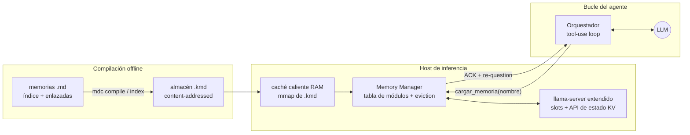
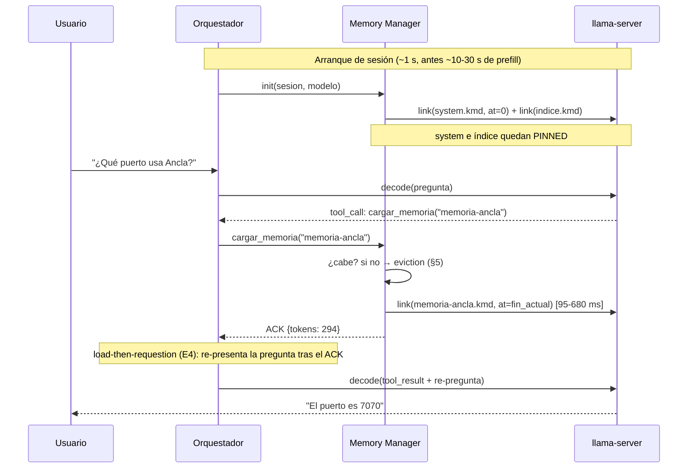

# Arquitectura: gestor de memorias KV precompiladas para agentes sobre llama.cpp

> English version: [ARCHITECTURE.md](ARCHITECTURE.md)

Diseño de referencia para usar módulos `.kmd` (memorias Markdown precompiladas a estado KV,
ver `NOTEBOOK.md` y `paper/PAPER.md`) en un agente en producción, con **carga dinámica por
tool-call** y **descarga por eviction** estilo Redis cuando se agota el presupuesto de contexto.

Estado: diseño basado en la PoC validada (fases A, B, 1, 1b y 2; primitivas de eviction,
compactación y paginación validadas después en E15-E18, ver §5.4 y §8). Los números de
latencia citados son medidos en la PoC (Intel Arc 140V, modelos 2B-7B Q4_K_M; los de
eviction/paginación, en RTX 4070 Ti SUPER).

> **Este documento mezcla código ya escrito, mecanismos validados experimentalmente y
> diseño propuesto.** Cada sección va etiquetada para distinguirlos:
>
> - 🟢 **Implementado** — hay código en este repo (`src/kmd/`, `experiments/`).
> - 🔵 **Validado** — el mecanismo está medido en un experimento (ver `EVIDENCE.es.md`).
> - 🟡 **Propuesto** — diseño de referencia para un gestor en producción; no construido aquí.
>
> | Sección | Estado |
> |---|---|
> | §1 Idea central | 🔵 Validado (linker, §5.2–5.7) |
> | §2.1 Compilador `mdc` | 🟢 Implementado (`src/kmd/mdc.py`) |
> | §2.2 Store de módulos + caché caliente | 🟡 Propuesto |
> | §2.3 Runtime: llama-server extendido | 🟡 Propuesto (restore/link base 🔵 validado) |
> | §2.4 Memory Manager ("classloader") | 🟡 Propuesto (patrón carga perezosa 🔵 validado, §5.4) |
> | §2.5 Herramienta del agente | 🟡 Propuesto |
> | §3 Flujo de sesión | 🟡 Propuesto |
> | §4 Layout del espacio de posiciones | 🔵 Validado (rebase/fusión, §4–§5.5) |
> | §5.1–5.2 Presupuesto/política de eviction | 🟡 Propuesto |
> | §5.3 Mecánica de descarga | 🔵 Validado (E15/E15b, §6.6) |
> | §5.4 Compactación | 🔵 Validado (E15/E15b, §6.6) |
> | §5.5 Pseudocódigo del load-path | 🟡 Propuesto |
> | §6 Compatibilidad por familia | 🔵 Validado (§5.5, §5.8, §5.9) |
> | §7 Observabilidad / modos de fallo | 🟡 Propuesto |
> | §8.1–8.4 Paginación de chunks + compilación paginada | 🔵 Validado (E16/E18, §6.7) |
> | §8.2 Selector de page-fault | 🟡 Propuesto (E18 usó selector oráculo) |
> | §8.4b Jerarquía VRAM→RAM→disco | 🔵 Validado como primitivo (E16), 🟡 jerarquía completa propuesta |
> | §8.5 Boceto de implementación | 🟡 Propuesto |
> | §9 Fases de implementación | 🟡 Propuesto (roadmap) |

---

## 1. Idea central

Una memoria de agente deja de ser texto que se re-procesa en cada sesión y pasa a ser un
**artefacto binario enlazable** (módulo `.kmd`): el estado KV que produjo su texto, compilado
una vez por (modelo, ABI), re-insertable en cualquier posición de un contexto vivo sin
re-evaluar el texto. La analogía operativa completa:

| JVM / classloader | Gestor de memorias KV |
|---|---|
| `.java` | memoria `.md` |
| `.class` (bytecode) | módulo `.kmd` (estado KV + cabecera de identidad) |
| `javac` | `mdc compile` (semántica *make*, staleness por hash) |
| classloader / linker | linker de módulos (rebase RoPE + fusión de secuencias) |
| classpath hell | resuelto por diseño: `module_id = sha256(versión\|modelo\|md\|dtype\|fa)` |
| heap con límite | celdas de KV cache / posiciones de contexto (`n_ctx`) |
| GC / eviction | gestor de eviction (LRU/LFU, pinning, compactación) |

Coste medido de "cargar memoria": **95-680 ms** (link) frente a segundos de prefill que
crecen con el tamaño del MD; la salida es indistinguible del prefill conjunto (paridad de
recall en E1-E7).

---

## 2. Componentes



### 2.1 `mdc` — compilador offline (existe: `poc/tool/mdc.py`; en el repo publicable, `src/kmd/mdc.py`, instalable con `pip install .`)

- Compila cada MD a `.kmd` por (modelo, ABI); `mdc index` recorre el índice y sus `[[enlaces]]`.
- Se ejecuta fuera del camino caliente: en CI del repo de memorias, o un watcher local
  (recompila al guardar el MD; 0,1-13 s/módulo según tamaño y si hay sondas híbridas).
- `mdc verify` en arranque detecta módulos caducados (MD editado, modelo cambiado) → recompilar.

### 2.2 Almacén de módulos + caché caliente

- Nivel 1: disco/NVMe, direccionado por contenido (`nombre.<module_id[:12]>.kmd`).
- Nivel 2: caché caliente en RAM (mmap o lectura anticipada) para los módulos del índice de la
  sesión activa — el link pasa a estar dominado por la copia host→VRAM y el K-shift.
- El módulo es **portable entre backends** (Vulkan/CPU probado) pero **atado al modelo y al ABI**
  (dtype KV, flash-attn); el gestor elige el `.kmd` que casa con el ABI del servidor.

### 2.3 Runtime: llama-server extendido

llama.cpp ya expone todas las primitivas (`llama_state_seq_get/set_data[_ext]`,
`llama_memory_seq_add/cp/rm`); lo que falta es exponerlas por slot en el server. Extensión
propuesta (endpoints sobre el slot de la sesión):

| Endpoint | Efecto |
|---|---|
| `POST /memory/link {module, at}` | inyecta el blob en seq auxiliar, rebase a `at` (o fin actual), fusiona en la seq del slot |
| `POST /memory/unload {module}` | `seq_rm` del rango de celdas del módulo |
| `POST /memory/compact` | compactación del espacio de posiciones (ver §5.4) |
| `GET /memory/list` | módulos cargados, posiciones, celdas, contadores |

Rebase por familia: RoPE estándar → `seq_add` (K-shift en dispositivo, funciona incluso con
K cuantizada); M-RoPE/híbridos (Qwen3.5) → **rebase software** (rotación NEOX de K en el blob,
host-side, validado en H17/H19; `seq_add` está vetado para M-RoPE). Híbridos GDN: política de
estado recurrente **naive** (S:=S_M; paridad total medida, módulo a mitad de tamaño).

### 2.4 Memory Manager ("classloader")

Proceso/biblioteca en el host que posee la **tabla de módulos por sesión** y ejecuta la
política de eviction. Es el único que habla con los endpoints `/memory/*`.

Tabla por sesión (el equivalente al keyspace de Redis):

```
module_id     pos_ini  n_tokens  celdas  bytes_kv  last_access  hits  pinned
indice        1024     512       512     75 MB     t0           -     SÍ
mem-general   1536     2111      2111    311 MB    t-2min       7     no
mem-ancla     3647     294       294     43 MB     t-40min      1     no
```

`last_access`/`hits` se actualizan cuando (a) la tool carga o consulta el módulo, y (b) el
orquestador atribuye una pregunta a un módulo (heurística: el módulo citado por la tool en el
turno; no hace falta instrumentar la atención).

### 2.5 La tool del agente

Contrato mínimo expuesto al LLM (function calling):

```json
{
  "name": "cargar_memoria",
  "description": "Carga en contexto una memoria del índice ([[nombre]]). Úsala antes de responder sobre temas cuyo detalle esté en una memoria enlazada no cargada.",
  "parameters": {"nombre": "string — slug del índice, p. ej. memoria-ancla"}
}
```

- La tool **no devuelve el contenido**: devuelve un ACK (`{"cargada": "memoria-ancla", "tokens": 294, "ms": 250}`). El contenido "aparece" en el contexto como estado KV.
- Opcional: `descargar_memoria(nombre)` explícita para agentes que gestionan su propio espacio;
  en general la descarga es responsabilidad del eviction automático (§5).
- El system prompt instruye: *"El índice lista memorias [[enlazadas]]. Si la pregunta requiere
  el detalle de una memoria no cargada, llama a cargar_memoria antes de responder."* (patrón
  validado en E4: el modelo detecta la necesidad desde el índice precompilado).

---

## 3. Flujo de una sesión



Puntos finos validados en la PoC:

- **Orden de lectura (E4/H11)**: la pregunta original queda *antes* del módulo → el turno que
  responde debe venir *después*. El re-decode de la pregunta tras el ACK (~20-40 tokens) recupera
  el recall de 3/10 a 8-9/10. Con tool-use esto es natural: el resultado de la tool ya fuerza un
  turno posterior al punto de inserción; conviene que el orquestador incluya la pregunta en el
  tool_result ("cargada; responde ahora a: …").
- **Composición (E3/E5/H14)**: si en el mismo turno se enlazan 2+ módulos, aplicar splice-k
  (~33% del módulo entrante re-prefilleado) para cerrar el déficit de atribución. Módulo único →
  link naïve, sin coste.
- **Aislamiento entre preguntas**: en híbridos no hay rollback parcial del estado recurrente →
  checkpoint con `seq_cp` a una seq auxiliar si el orquestador necesita retractar turnos.

---

## 4. Layout del espacio de posiciones

```
pos 0                                                                 n_ctx
 |-- system.kmd --|-- indice.kmd --|== conversación + módulos dinámicos ==>|
      (pinned)         (pinned)        crece; los módulos se insertan
                                       SIEMPRE en el fin actual
```

Decisión: **los módulos dinámicos se insertan en el fin actual del contexto** (adyacentes a la
conversación que los pidió), no en una arena fija:

- Es el régimen validado experimentalmente (E1-E7: inserción en el punto de uso, paridad total).
- Mantiene distancias posicionales cortas entre pregunta y memoria.
- La descarga (`seq_rm` de un rango) deja **huecos de posiciones lógicas**, que la atención
  tolera sin problema (las posiciones no necesitan ser densas). El hueco no se reutiliza:
  el espacio de posiciones solo crece → hace falta compactación eventual (§5.4).

---

## 5. Eviction estilo Redis

### 5.1 Presupuesto (equivalente a `maxmemory`)

Dos recursos, se vigila el más restrictivo:

- **Celdas de KV** (memoria física/VRAM): `celdas_usadas ≤ n_ctx_celdas`.
- **Espacio de posiciones lógicas**: `pos_max ≤ n_ctx_entrenado` (RoPE fiable).

Configuración: `high_watermark` (p. ej. 85%) dispara eviction; `low_watermark` (p. ej. 70%)
es el objetivo al que se desaloja. Se comprueba **antes de cada link** (y antes de cada turno
largo de conversación).

### 5.2 Política (equivalente a `maxmemory-policy`)

- **Por defecto: `allkeys-lru` con pinning** — se desaloja el módulo con `last_access` más
  antiguo, **exceptuando siempre**: system, índice (pinned), y los módulos usados en el turno
  en curso.
- Alternativas por configuración, como en Redis: LFU (`hits` con decaimiento — mejor si hay
  módulos "calientes" recurrentes), TTL por módulo (memorias efímeras de sesión), o
  tamaño-ponderado (desalojar primero el módulo grande menos usado: `score = celdas / (1+hits)`
  — recupera más espacio por eviction).
- **La conversación no se desaloja con esta política** (no es un módulo); si el límite lo marca
  la conversación misma, aplican las técnicas ortodoxas (resumen + truncado) o — extensión
  natural de este trabajo — *snapshot* de la conversación viva a módulo (`state_seq_get_data`)
  y archivado.

### 5.3 Mecánica de descarga

- **Atención**: `seq_rm(seq, pos_ini, pos_ini + n_tokens)` libera las celdas del módulo.
  Coste ~0. Es reversible: un cache-miss posterior re-enlaza el `.kmd` (95-680 ms), como un
  miss de Redis contra el almacén frío.
- **Híbridos (matiz importante)**: la contribución del módulo al **estado recurrente** de la
  secuencia es aditiva e irreversible — no se puede "restar" al descargar. Consecuencias
  prácticas: (a) no se recupera memoria por esa vía, pero tampoco se consume (el estado es de
  tamaño fijo); (b) tras descargar las celdas de atención del módulo, el estado GDN conserva un
  eco decreciente del módulo (el gating lo contrae, H15/H17) — inocuo en lo medido, pero es la
  razón de que el unload híbrido sea "best effort". Si se requiere limpieza exacta: checkpoint
  del estado recurrente (`seq_cp` o blob PARTIAL) antes de cada link, y restauración al descargar.
- El manager actualiza la tabla y notifica al agente por el canal de la tool si procede
  ("memoria X descargada por presión de contexto; vuelve a cargarla si la necesitas").

### 5.4 Compactación (el "defrag" que Redis no necesita)

Tras muchas cargas/descargas, el espacio de posiciones se fragmenta (huecos no reutilizables) y
`pos_max` se acerca al límite aunque haya pocas celdas vivas. Compactar = desplazar los rangos
vivos hacia posiciones bajas:

- RoPE estándar: `seq_add(seq, p0, p1, -delta)` por rango vivo (K-shift en dispositivo, barato).
- M-RoPE/híbridos: rebase software del blob (get→rotar→set, decenas-cientos de ms).
- Disparador: `pos_max > 90% n_ctx` con ocupación de celdas < 50%, o de forma perezosa en
  momentos de inactividad del slot. Es una pausa tipo GC; con presupuestos bien dimensionados
  debería ser rara.

**VALIDADO (E15/H34)**: el primitivo evict+compact funciona en vivo a mitad
de conversación — `seq_rm` del rango del módulo + `seq_add` negativo de la cola cuesta
**0,5–1,0 ms** (el K-shift perezoso aterriza en el siguiente decode) y es **conductualmente
neutro**: la batería aislada da lo mismo con paginación (22/42) que con todo residente
(21/42), el working set queda acotado (pico 16k vs 34k celdas) y la conversación conserva
sus propios turnos tras 6 compactaciones (las filas KV de las respuestas generadas retienen
lo dicho aunque el documento origen ya no esté). Notas de arnés agéntico en H34: con módulos
multi-k, re-preguntar tras la carga (E4b) es obligatorio, y las plantillas de pregunta
repetidas provocan auto-imitación (el modelo copia su respuesta anterior en vez de leer el
módulo) — diseño del prompt del Memory Manager, no límite del mecanismo. Híbridos GDN:
**también VALIDADO (E15b/H34)** — sus capas de atención no necesitan siquiera
compactación separada y las recurrentes no tienen nada que compactar (estado de tamaño
fijo); el límite semántico (el estado es un acumulador con pérdida: la contribución del
doc no se puede "des-reducir", T_doc contractivo) se resuelve con **checkpoint + replay**:
`seq_cp(0→seq de reserva)` antes de enlazar (snapshot COW completo — el `seq_rm` parcial
de cola está vetado en memoria recurrente, H17), y al evictar wipe + restore + re-decode
de la cola. Medido en Qwen3.5-4B: evicción **4,7-4,9 ms** (replay de ~50 tok), batería
41/42 == control 39/42, working set 13,7k vs 29,6k celdas, coherencia conversacional
intacta. Coste O(cola), nunca O(documento).

### 5.5 Pseudocódigo del camino de carga

```python
def cargar_memoria(sesion, nombre):
    mod = store.resolve(nombre, sesion.model_sha, sesion.abi)   # .kmd correcto
    if mod.stale: mod = mdc.recompile(mod)                       # verify → make
    need = mod.n_tokens
    while sesion.celdas_libres() < need or sesion.pos_libres() < need:
        victima = min(sesion.modulos_no_pinned(), key=politica)  # LRU/LFU/size
        if victima is None: return ERROR_SIN_ESPACIO             # todo pinned
        runtime.unload(sesion.slot, victima); tabla.remove(victima)
    runtime.link(sesion.slot, mod, at=sesion.pos_fin)            # rebase+fusión
    tabla.add(mod, pos=sesion.pos_fin, last_access=now(), pinned=False)
    return ACK(mod.n_tokens)
```

---

## 6. Compatibilidad por familia de modelo (resumen operativo)

| Familia | Link | Rebase | Estado extra | Notas |
|---|---|---|---|---|
| RoPE estándar, atención completa (Qwen3, Llama 3.x, Coder) | ✔ validado | `seq_add` nativo (incl. K cuantizada) | — | régimen principal; dtype KV libre hasta q4 |
| M-RoPE + híbrido GDN (Qwen3.5/3.6) | ✔ validado | **software** (K f16) | recurrente: política naive; unload best-effort | ChatML + no-think en evaluación |
| Mamba/RWKV puros | pendiente (fase 1c) | no aplica (estado invariante) | afín (T_M, S_M) imprescindible | único caso donde naive pierde el prefijo |
| MTP (cabezal draft) | ✔ validado (E13v2, H29) | el del target | blob draft (~5 MB/1,3k tok), empaquetable en el propio `.kmd` (sección `mtp`, formato v1, `mdc mtp-pack`/`mtp-unpack`, H40) | requiere parche `patches/` en llama.cpp (candidato upstream); en vLLM soportado por diseño (H30) aunque el conector KV aún no acepta híbridos (H39); sin blob degrada con gracia (acc 0,69→0,59, respuesta intacta) |
| SWA intercalada (Gemma 3) | ✔ validado (E20, H41) | `seq_add` nativo sobre caché iSWA | — | paridad exacta joint=naive con módulo ≲ ventana; módulo ≫ ventana degrada **igual en ambas condiciones** (techo del modelo, no del linker); blobs ~3× más pequeños (capas SWA solo serializan su ventana); reparación splice-k sin probar |

Reglas duras: módulo atado a (modelo exacto, tokenizer, dtype KV, flash-attn); `verify` en
carga; jamás mezclar ABIs en una sesión (el manager selecciona por ABI del servidor).

---

## 7. Observabilidad y modos de fallo

- **Métricas**: hit-rate de la caché caliente, latencia de link (p50/p99), evictions/hora,
  compactaciones/día, ocupación de celdas y de posiciones, módulos stale detectados.
- **Fallos previstos**: módulo caducado (→ recompilación transparente, +segundos una vez);
  ABI mismatch (→ `mdc convert` si es solo FA, si no recompilar); sin espacio con todo pinned
  (→ error a la tool, el agente decide qué soltar); crash del slot (→ re-link de pinned +
  reconstrucción perezosa: los `.kmd` son la fuente de verdad, el estado del slot es caché).
- **Trampa conocida**: modelos *thinking* + límites de generación cortos simulan déficits de
  calidad (H19) — presupuestar el thinking en cualquier evaluación del sistema.

---

## 8. Extensión: paginación por chunks (memoria virtual de documentos)

Idea: dividir un `.kmd` grande en **N chunks internos**
(p. ej. 2k tokens) y paginarlos dinámicamente dentro de un presupuesto de KV fijo, al estilo
del *bank switching* de las consolas de 8 bits: se libera el banco que no interesa y se mapea
el siguiente. Convierte el límite de contexto en un **límite de working set**: documentos de
tamaño arbitrario con KV residente acotado. La analogía con memoria virtual es exacta
(espacio de direcciones ilimitado, conjunto residente acotado, el rendimiento depende de la
localidad de acceso).

### 8.1 Por qué encaja casi gratis en las primitivas existentes

- **El rebase software ya es el bank switch**: mapea cualquier rango compilado a cualquier
  ventana de posiciones en O(chunk), sin re-prefill (H17/H19).
- El formato ya corta rangos de celdas (`r_slices` en `mdc`); "N chunks" es una tabla de
  offsets en la cabecera `.kmd` — cada chunk direccionable individualmente.
- E11 (workspace multi-módulo, carga lazy 0/6→6/6 en 1,13 s) es la misma mecánica a
  granularidad de módulo; esto la baja a sub-módulo.
- Coste de paginar un chunk de 2k f16: ~0,1 s de restore (extrapolado de H27) + rebase.
- Es el §5 (eviction) con granularidad intra-módulo: misma tabla, mismos watermarks; el chunk
  hereda `last_access`/`hits` y el pinning pasa a ser por-chunk (p. ej. el chunk-resumen).

### 8.2 El selector del page fault — DECIDIDO: híbrido RAG + tool

En la consola, el programador conocía el patrón de acceso; "dónde quiere mirar la atención"
**no es observable en binarios stock**. Selectores posibles: model-driven (tool),
retrieval-driven (embeddings), sondas de atención (descartado: rompe binarios stock).

**Decisión de diseño: fusionar RAG y linker — "RAG localiza el qué, `.kmd` carga".**

- El vector store deja de ser almacén de contenido y pasa a ser **tabla de páginas
  semántica**: los embeddings se calculan sobre el texto (frases), pero el payload de la
  búsqueda es una referencia `{module_id, chunk_offset}` — el linker carga ese rango KV
  en lugar de re-prefillear texto recuperado. RAG resuelve la selección; el linker, la
  inyección. Ortogonales, compuestos.
- **Granularidad doble (patrón small-to-big)**: se *indexa por frase* (unidad de matching)
  y se *compila/carga por párrafo o sección* (unidad de KV); cada embedding de frase apunta
  a su chunk padre. La tabla de offsets del `.kmd` admite chunks de tamaño variable
  cortados por frontera semántica (secciones MD), lo que además minimiza el castigo de
  costura (déficit de composición, reparable con splice-k).
- **No compilar demasiado fino**: una frase aislada produce KV empobrecido (ventana de
  atención minúscula + attention sink propio, cf. EPIC/LegoLink). Unidad de compilación
  sana: párrafo/sección (validado desde ~300 tokens); la frase es unidad de búsqueda,
  no de compilación.
- **Fallback model-driven**: si el retrieval falla, la tool `buscar_chunk(consulta)`
  (patrón load-then-requestion de §3) es el segundo nivel — el modelo pide página en el
  miss. Retrieval para el caso común barato; tool para el residuo.

### 8.3 Pegas conocidas (honestas, antes de implementar)

- **Thrashing / síntesis cross-chunk**: si la tarea exige combinar chunks 3 y 17 y el
  presupuesto aloja uno, el modelo pagina ida y vuelta sin poder atender a ambos; es el punto
  débil multi-hop (pendiente de medir) elevado al cuadrado. Mitigaciones: working set ≥ 2-3
  chunks + chunk-resumen pinned (mapa global barato).
- **El selector manda**: con selector malo, N fallos × latencia; solo gana claramente en
  consumer/edge/offload (coherente con §5.6 del paper — es *feature*, acota el claim).
- **Prior art a posicionar**: InfLLM (bloques de contexto fuera de GPU recuperados por
  relevancia) y Quest (selección de bloques KV consciente de la query) hacen esto a nivel de
  kernel/runtime. El diferencial nuestro: chunks **precompilados, persistentes, portables y
  paginados desde disco entre sesiones sobre binarios stock** — memoria virtual construida
  encima del linker, no dentro del kernel de atención.
- **Híbridos**: paginar chunks de atención no toca el estado recurrente vivo (funciona por la
  misma razón que el linker GDN: el recall factual vive en la atención, H15/H17), pero el
  matiz de unload best-effort de §5.3 aplica por chunk, y el multi-hop se agrava.

### 8.4 Compilación paginada (la escritura, simétrica de la lectura)

¿Se pueden generar los `.kmd` de documentos gigantescos
sin desbordar la VRAM? Sí — dos mecanismos:

1. **Compilación por chunks aislados** (el simétrico exacto del lector §8.1): prefill de
   cada chunk de ~2k por separado → serializar → liberar → siguiente. VRAM = O(1 chunk)
   (~300 MB en un 4B f16), disco = O(documento). Bonus: (a) atención lineal en chunks en
   lugar de cuadrática en n → *más barato* que el prefill conjunto; (b) vergonzosamente
   paralelo → granja de compilación multi-máquina; (c) produce exactamente el artefacto
   que el lector paginado consume. Precio semántico: contextualización por-chunk (la
   compilación aislada que E10 valida para recall factual — "linked > joint"; el
   multi-hop de §8.3 es el caso adverso; mitigación: chunk-resumen global pinned).
2. **KV en RAM del host** (`--no-kv-offload`) para documentos que caben en el contexto
   entrenado pero no en VRAM: techo = RAM (62 GB en el servidor), no VRAM; lento pero
   offline (la serialización ya copia bytes del host — sin coste extra). La compilación
   nunca necesita la GPU buena (módulos compilados en portátil enlazan en CUDA, H23).

Límite duro común: el contexto *entrenado* del modelo (RoPE fiable). Más allá de n_ctx,
el chunking aislado es la única física posible — la paginación pasa de optimización a
definición del "documento infinito": VRAM y n_ctx dejan de acotar el tamaño del documento;
lo acota el working set.

### 8.4b Jerarquía VRAM→RAM→disco: "memoria virtual" del propio contexto

Pregunta origen: ¿por qué se puede hacer offload de los *pesos* a RAM y no de la KV cache?
¿Y si el contexto se expandiera virtualmente más allá de la VRAM — el LLM enfocado en el
último bloque (VRAM) mientras el inicio de la conversación se archiva en RAM?

**Lo que ya existe (y su forma):**
- *Partición vertical (por capa)*: con `-ngl` parcial, la KV de las capas que corren en CPU
  YA vive en RAM — llama.cpp asigna la cache donde corre cada capa. Es el régimen "offload
  parcial" de E12 (×19,0).
- *Total*: `--no-kv-offload` — TODA la KV en RAM, atención computada en CPU (cruzan el bus
  las activaciones, KBs, no el KV). Techo = RAM; lento pero funcional (§8.4).
- *vLLM swap*: bloques KV GPU↔CPU por secuencia, pero para planificación (pausar/reanudar
  peticiones), no para atender desde RAM.

**Lo que NO existe y propone la idea: partición temporal (horizontal)** — posiciones
recientes en VRAM, antiguas archivadas. La versión naive (atender cada token a KV que vive
en RAM vía PCIe) es hostil: la atención lee TODO el KV por token generado (~150 KB/token ×
contexto → GBs/token a 50k) y el bus se come el throughput. La versión buena no atiende a
lo archivado en cada paso — y eso es exactamente **nuestra paginación aplicada a la propia
conversación**:

1. **Sellado**: al cruzar un umbral (p. ej. 75 % de n_ctx), el Memory Manager sella el
   segmento más antiguo de conversación como módulo anónimo: state save del rango → blob
   en RAM (o `.kmd` en disco — jerarquía completa VRAM→RAM→NVMe, y H33 dice que el escalón
   RAM/NVMe es casi gratis).
2. **Evicción + compactación**: E15 (~1 ms full-attention) / E15b (~5 ms híbridos). Los
   *sinks* (primeros tokens) quedan pinned — StreamingLLM; el sink-dropping ya se midió en E1.
3. **Page-in bajo demanda**: si la conversación vuelve sobre lo archivado, el selector de
   §8.2 (RAG sobre el texto del segmento / tool) re-enlaza el módulo con rebase a la
   posición actual. E15 ya demostró la propiedad clave que lo hace tolerable: **lo dicho se
   conserva** (las filas KV de las respuestas retienen el contenido del segmento evictado);
   lo no dicho se recupera con el re-link exacto — mejor que el resumen con pérdida de los
   frameworks de agentes, que puede convivir como índice (resumen textual pinned + KV
   archivado re-linkable = compactación con pérdida *recuperable*).

Resultado: contexto conversacional con lo *direccionable* acotado por el almacenamiento
y working set acotado = ventana reciente + módulos calientes.

**Rigor / prior art (NO hemos inventado la memoria virtual para LLMs — el hueco es más
fino):** la metáfora existe en tres niveles. (a) **MemGPT** (Packer et al. 2023, "Towards
LLMs as Operating Systems"): memoria virtual *textual* — page-out = resumen (con pérdida),
page-in = re-prefill (paga el impuesto que nuestro paper elimina). (b) **PagedAttention**
(vLLM): paginación *física* de bloques KV en GPU (block tables = page tables), no extiende
lo direccionable por la secuencia. (c) **InfLLM/Quest/KEEP**: tiering/selección de KV
*dentro de un motor modificado* — sin persistencia, sin reubicación, sin portabilidad;
muere con el proceso. **Lo que sí es nuestro**: el page file de *estado compilado* a nivel
de agente sobre runtimes stock, con reubicación (rebase) y artefactos que sobreviven al
proceso y viajan entre máquinas — page-in con fidelidad exacta a coste O(bytes) en lugar
de resume-y-reprefillea. Matiz obligatorio al comunicarlo: se extiende lo direccionable,
NUNCA la ventana de atención residente (n_ctx entrenado).

Banco de prueba: E16 — conversación sintética > n_ctx, sellado por segmentos,
preguntas sobre segmentos archivados con page-in vs sin él, y coherencia a lo largo de N
sellados (validado, H37).

### 8.5 Esbozo de implementación mínima

1. `mdc compile --chunks 2048`: tabla de offsets por chunk en la cabecera (formato ya
   versionado; cambio retrocompatible).
2. `mdc link --chunk i` / `runtime.unload_chunk`: link/unload de rangos (existe como slicing).
3. Tool `paginar_documento(nombre, consulta|siguiente)` sobre el Memory Manager, con la
   política de §5 a granularidad de chunk.
4. Banco de prueba: documento 50-100k tok, preguntas locales (1 chunk) vs multi-hop
   (2+ chunks), presupuesto 8k; métricas: fallos de página, latencia/fallo, recall vs
   full-context y vs RAG.

## 9. Fases de implementación

1. **Prototipo in-process** (existe ~80%): `llamalib.py` + `hyblib.py` + `mdc link` ya hacen
   compile/link/rebase; falta la tabla de módulos + eviction (§5.5, ~200 líneas).
2. **Extensión llama-server**: endpoints `/memory/*` sobre slots (C++ o sidecar Python con el
   server en modo `--slot-save-path` como fallback degradado).
3. **Tool en el orquestador**: `cargar_memoria` + load-then-requestion + system prompt del índice.
4. **Eviction manager**: watermarks, LRU con pinning, compactación perezosa, métricas.
5. Investigación en paralelo: modelos puramente recurrentes (Mamba/RWKV), validación
   vLLM/LMCache ampliada, evidencia a mayor escala.
