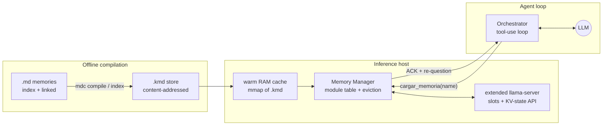
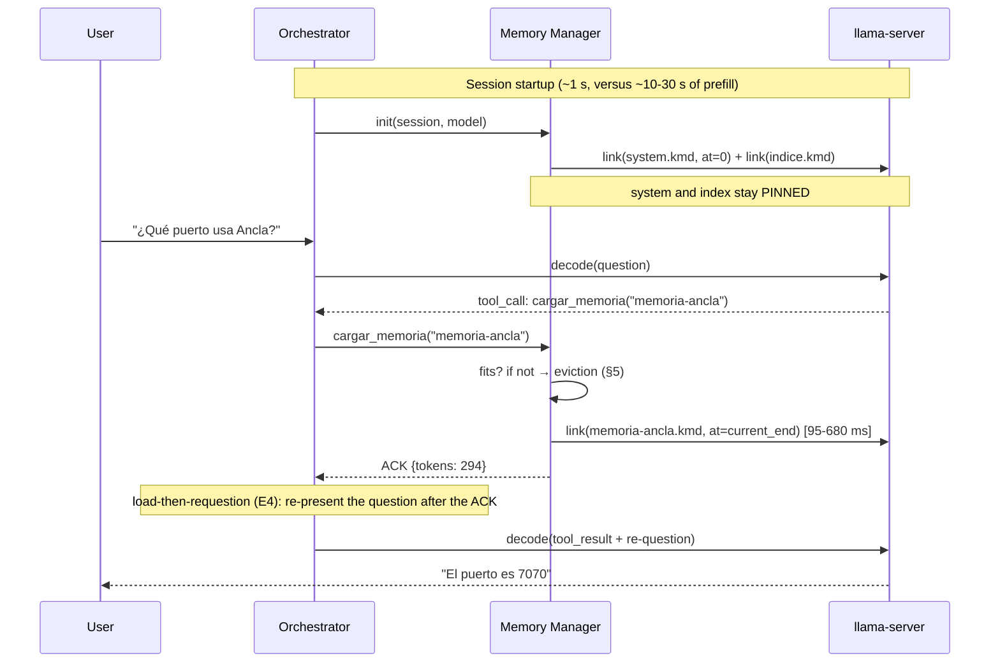

# Architecture: a precompiled-KV memory manager for agents on llama.cpp

> Versión en castellano: [ARCHITECTURE.es.md](ARCHITECTURE.es.md)

Reference design for using `.kmd` modules (Markdown memories precompiled to KV state, see
`NOTEBOOK.md` and `paper/PAPER.md`) in a production agent, with **dynamic loading via
tool-call** and Redis-style **eviction** when the context budget runs out.

Status: design grounded in the validated PoC (phases A, B, 1, 1b and 2; the eviction,
compaction and paging primitives validated later in E15-E18, see §5.4 and §8). The latency
numbers quoted are measured in the PoC (Intel Arc 140V, 2B-7B Q4_K_M models; the
eviction/paging ones, on an RTX 4070 Ti SUPER).

> **This document mixes shipped code, experimentally validated mechanisms, and proposed
> design.** Each section is tagged so the reader can tell them apart:
>
> - 🟢 **Implemented** — code exists in this repo (`src/kmd/`, `experiments/`).
> - 🔵 **Validated** — the mechanism is measured in an experiment (see `EVIDENCE.md`).
> - 🟡 **Proposed** — reference design for a production manager; not built here.
>
> | Section | Status |
> |---|---|
> | §1 Core idea | 🔵 Validated (linker, §5.2–5.7) |
> | §2.1 `mdc` compiler | 🟢 Implemented (`src/kmd/mdc.py`) |
> | §2.2 Module store + warm cache | 🟡 Proposed |
> | §2.3 Runtime: extended llama-server | 🟡 Proposed (base restore/link 🔵 validated) |
> | §2.4 Memory Manager ("classloader") | 🟡 Proposed (lazy-load pattern 🔵 validated, §5.4) |
> | §2.5 Agent tool | 🟡 Proposed |
> | §3 Session flow | 🟡 Proposed |
> | §4 Position-space layout | 🔵 Validated (rebase/fusion, §4–§5.5) |
> | §5.1–5.2 Eviction budget/policy | 🟡 Proposed |
> | §5.3 Unload mechanics | 🔵 Validated (E15/E15b, §6.6) |
> | §5.4 Compaction | 🔵 Validated (E15/E15b, §6.6) |
> | §5.5 Load-path pseudocode | 🟡 Proposed |
> | §6 Compatibility per model family | 🔵 Validated (§5.5, §5.8, §5.9) |
> | §7 Observability / failure modes | 🟡 Proposed |
> | §8.1–8.4 Chunk paging + paged compilation | 🔵 Validated (E16/E18, §6.7) |
> | §8.2 Page-fault selector | 🟡 Proposed (E18 used an oracle selector) |
> | §8.4b VRAM→RAM→disk hierarchy | 🔵 Validated as primitive (E16), 🟡 full hierarchy proposed |
> | §8.5 Implementation sketch | 🟡 Proposed |
> | §9 Implementation phases | 🟡 Proposed (roadmap) |

---

## 1. Core idea

An agent memory stops being text re-processed every session and becomes a **linkable binary
artifact** (a `.kmd` module): the KV state its text produced, compiled once per (model, ABI),
re-insertable at any position of a live context without re-evaluating the text. The full
operating analogy:

| JVM / classloader | KV memory manager |
|---|---|
| `.java` | `.md` memory |
| `.class` (bytecode) | `.kmd` module (KV state + identity header) |
| `javac` | `mdc compile` (*make* semantics, hash-based staleness) |
| classloader / linker | module linker (RoPE rebase + sequence fusion) |
| classpath hell | solved by design: `module_id = sha256(version\|model\|md\|dtype\|fa)` |
| bounded heap | KV-cache cells / context positions (`n_ctx`) |
| GC / eviction | eviction manager (LRU/LFU, pinning, compaction) |

Measured cost of "loading a memory": **95-680 ms** (link) versus seconds of prefill that grow
with MD size; the output is indistinguishable from joint prefill (recall parity in E1-E7).

---

## 2. Components



### 2.1 `mdc` — the offline compiler (exists: `src/kmd/mdc.py`, installable with `pip install .`)

- Compiles each MD to a `.kmd` per (model, ABI); `mdc index` walks the index and its `[[links]]`.
- Runs off the hot path: in the memory repo's CI, or a local watcher (recompile on MD save;
  0.1-13 s/module depending on size and whether hybrid probes are needed).
- `mdc verify` at startup detects stale modules (edited MD, changed model) → recompile.

### 2.2 Module store + warm cache

- Tier 1: disk/NVMe, content-addressed (`name.<module_id[:12]>.kmd`).
- Tier 2: warm RAM cache (mmap or read-ahead) for the active session's index modules — the
  link becomes dominated by the host→VRAM copy and the K-shift.
- A module is **portable across backends** (Vulkan/CPU tested) but **bound to the model and
  the ABI** (KV dtype, flash-attn); the manager picks the `.kmd` matching the server's ABI.

### 2.3 Runtime: extended llama-server

llama.cpp already exposes every primitive (`llama_state_seq_get/set_data[_ext]`,
`llama_memory_seq_add/cp/rm`); what is missing is exposing them per slot in the server.
Proposed extension (endpoints over the session's slot):

| Endpoint | Effect |
|---|---|
| `POST /memory/link {module, at}` | injects the blob into an aux seq, rebases to `at` (or the current end), fuses into the slot's seq |
| `POST /memory/unload {module}` | `seq_rm` of the module's cell range |
| `POST /memory/compact` | position-space compaction (see §5.4) |
| `GET /memory/list` | loaded modules, positions, cells, counters |

Rebase per family: standard RoPE → `seq_add` (on-device K-shift, works even on quantized K);
M-RoPE/hybrids (Qwen3.5) → **software rebase** (NEOX rotation of K in the blob, host-side,
validated in H17/H19; `seq_add` is vetoed for M-RoPE). GDN hybrids: recurrent-state policy
**naive** (S:=S_M; full parity measured, module at half size).

### 2.4 Memory Manager (the "classloader")

A host process/library owning the **per-session module table** and running the eviction
policy. It is the only component that talks to the `/memory/*` endpoints.

Per-session table (the equivalent of Redis's keyspace):

```
module_id     pos_start  n_tokens  cells  kv_bytes  last_access  hits  pinned
indice        1024       512       512    75 MB     t0           -     YES
mem-general   1536       2111      2111   311 MB    t-2min       7     no
mem-ancla     3647       294       294    43 MB     t-40min      1     no
```

`last_access`/`hits` update when (a) the tool loads or queries the module, and (b) the
orchestrator attributes a question to a module (heuristic: the module the tool cited that
turn; no attention instrumentation needed).

### 2.5 The agent's tool

Minimal contract exposed to the LLM (function calling):

```json
{
  "name": "cargar_memoria",
  "description": "Carga en contexto una memoria del índice ([[nombre]]). Úsala antes de responder sobre temas cuyo detalle esté en una memoria enlazada no cargada.",
  "parameters": {"nombre": "string — slug del índice, p. ej. memoria-ancla"}
}
```

- The tool **does not return the content**: it returns an ACK (`{"cargada": "memoria-ancla", "tokens": 294, "ms": 250}`). The content "appears" in the context as KV state.
- Optional: an explicit `descargar_memoria(name)` for agents managing their own space; in
  general, unloading is the automatic eviction's job (§5).
- The system prompt instructs: *"The index lists [[linked]] memories. If the question needs
  the detail of an unloaded memory, call cargar_memoria before answering."* (pattern
  validated in E4: the model detects the need from the precompiled index).

---

## 3. Session flow



Fine points validated in the PoC:

- **Reading order (E4/H11)**: the original question sits *before* the module → the answering
  turn must come *after* it. Re-decoding the question after the ACK (~20-40 tokens) recovers
  recall from 3/10 to 8-9/10. With tool-use this is natural: the tool result already forces a
  turn after the insertion point; the orchestrator should include the question in the
  tool_result ("loaded; now answer: …").
- **Composition (E3/E5/H14)**: if 2+ modules are linked in the same turn, apply splice-k
  (~33% of the incoming module re-prefilled) to close the attribution deficit. Single module →
  naïve link, no cost.
- **Isolation between questions**: hybrids have no partial rollback of recurrent state →
  checkpoint with `seq_cp` to an auxiliary seq if the orchestrator needs to retract turns.

---

## 4. Position-space layout

```
pos 0                                                                 n_ctx
 |-- system.kmd --|-- indice.kmd --|== conversation + dynamic modules ==>|
      (pinned)         (pinned)        grows; modules are ALWAYS
                                       inserted at the current end
```

Decision: **dynamic modules are inserted at the current end of the context** (adjacent to the
conversation that requested them), not in a fixed arena:

- It is the experimentally validated regime (E1-E7: insertion at the point of use, full parity).
- It keeps positional distances between question and memory short.
- Unloading (`seq_rm` of a range) leaves **logical position holes**, which attention tolerates
  fine (positions need not be dense). The hole is not reused: position space only grows →
  eventual compaction is needed (§5.4).

---

## 5. Redis-style eviction

### 5.1 Budget (the `maxmemory` equivalent)

Two resources; the more restrictive one is watched:

- **KV cells** (physical/VRAM memory): `cells_used ≤ n_ctx_cells`.
- **Logical position space**: `pos_max ≤ n_ctx_trained` (reliable RoPE).

Configuration: a `high_watermark` (e.g. 85%) triggers eviction; a `low_watermark` (e.g. 70%)
is the target to evict down to. Checked **before every link** (and before every long
conversation turn).

### 5.2 Policy (the `maxmemory-policy` equivalent)

- **Default: `allkeys-lru` with pinning** — evict the module with the oldest `last_access`,
  **always excepting**: system, index (pinned), and the modules used in the current turn.
- Configurable alternatives, as in Redis: LFU (`hits` with decay — better with recurring "hot"
  modules), per-module TTL (ephemeral session memories), or size-weighted (evict the biggest
  least-used module first: `score = cells / (1+hits)` — reclaims more space per eviction).
- **The conversation is not evicted under this policy** (it is not a module); if the limit is
  set by the conversation itself, the orthodox techniques apply (summarize + truncate) or — a
  natural extension of this work — *snapshotting* the live conversation to a module
  (`state_seq_get_data`) and archiving it.

### 5.3 Unload mechanics

- **Attention**: `seq_rm(seq, pos_start, pos_start + n_tokens)` frees the module's cells.
  Cost ~0. Reversible: a later cache-miss re-links the `.kmd` (95-680 ms), like a Redis miss
  against cold storage.
- **Hybrids (important nuance)**: the module's contribution to the sequence's **recurrent
  state** is additive and irreversible — it cannot be "subtracted" on unload. Practical
  consequences: (a) no memory is reclaimed that way, but none is consumed either (the state
  is fixed-size); (b) after unloading the module's attention cells, the GDN state keeps a
  decaying echo of the module (the gating contracts it, H15/H17) — innocuous in everything
  measured, but the reason hybrid unload is "best effort". If exact cleanup is required:
  checkpoint the recurrent state (`seq_cp` or a PARTIAL blob) before each link, and restore
  on unload.
- The manager updates the table and notifies the agent over the tool channel when relevant
  ("memory X unloaded under context pressure; reload it if you need it").

### 5.4 Compaction (the "defrag" Redis never needs)

After many loads/unloads, position space fragments (non-reusable holes) and `pos_max`
approaches the limit even with few live cells. Compacting = shifting live ranges down to low
positions:

- Standard RoPE: `seq_add(seq, p0, p1, -delta)` per live range (on-device K-shift, cheap).
- M-RoPE/hybrids: software rebase of the blob (get→rotate→set, tens-hundreds of ms).
- Trigger: `pos_max > 90% n_ctx` with cell occupancy < 50%, or lazily during slot idle time.
  It is a GC-style pause; with well-sized budgets it should be rare.

**VALIDATED (E15/H34)**: the evict+compact primitive works live mid-conversation — `seq_rm`
of the module's range + negative `seq_add` of the tail costs **0.5–1.0 ms** (the lazy K-shift
lands on the next decode) and is **behaviorally neutral**: the isolated battery scores the
same with paging (22/42) as fully resident (21/42), the working set stays bounded (peak 16k
vs 34k cells) and the conversation keeps its own turns after 6 compactions (the KV rows of
generated answers retain what was said even once the source document is gone). Agentic
harness notes in H34: with multi-k modules, re-questioning after the load (E4b) is mandatory,
and repeated question templates cause self-imitation (the model copies its previous answer
instead of reading the module) — Memory Manager prompt design, not a mechanism limit. GDN
hybrids: **also VALIDATED (E15b/H34)** — their attention layers need no separate compaction
and the recurrent ones have nothing to compact (fixed-size state); the semantic limit (the
state is a lossy accumulator: the doc's contribution cannot be "un-reduced", T_doc
contractive) is solved with **checkpoint + replay**: `seq_cp(0→reserve seq)` before linking
(a full COW snapshot — partial tail `seq_rm` is vetoed on recurrent memory, H17), and on
eviction wipe + restore + re-decode of the tail. Measured on Qwen3.5-4B: eviction
**4.7-4.9 ms** (~50-token replay), battery 41/42 == control 39/42, working set 13.7k vs
29.6k cells, conversational coherence intact. Cost O(tail), never O(document).

### 5.5 Load-path pseudocode

```python
def cargar_memoria(session, name):
    mod = store.resolve(name, session.model_sha, session.abi)    # the right .kmd
    if mod.stale: mod = mdc.recompile(mod)                       # verify → make
    need = mod.n_tokens
    while session.free_cells() < need or session.free_pos() < need:
        victim = min(session.unpinned_modules(), key=policy)     # LRU/LFU/size
        if victim is None: return ERROR_NO_SPACE                 # everything pinned
        runtime.unload(session.slot, victim); table.remove(victim)
    runtime.link(session.slot, mod, at=session.pos_end)          # rebase+fusion
    table.add(mod, pos=session.pos_end, last_access=now(), pinned=False)
    return ACK(mod.n_tokens)
```

---

## 6. Compatibility per model family (operational summary)

| Family | Link | Rebase | Extra state | Notes |
|---|---|---|---|---|
| Standard RoPE, full attention (Qwen3, Llama 3.x, Coder) | ✔ validated | native `seq_add` (incl. quantized K) | — | main regime; KV dtype free down to q4 |
| M-RoPE + GDN hybrid (Qwen3.5/3.6) | ✔ validated | **software** (f16 K) | recurrent: naive policy; best-effort unload | ChatML + no-think during evaluation |
| Pure Mamba/RWKV | pending | n/a (position-invariant state) | affine (T_M, S_M) indispensable | the only case where naive loses the prefix |
| MTP (draft head) | ✔ validated (E13v2, H29) | the target's | draft blob (~5 MB/1.3k tok), packageable in the `.kmd` itself (`mtp` section, format v1, `mdc mtp-pack`/`mtp-unpack`, H40) | requires the `patches/` llama.cpp patch (upstream candidate); supported by design in vLLM (H30) though the KV connector does not accept hybrids yet (H39); without the blob it degrades gracefully (acc 0.69→0.59, answers intact) |
| Interleaved SWA (Gemma 3) | ✔ validated (E20, H41) | native `seq_add` over the iSWA cache | — | exact joint=naive parity with module ≲ window; module ≫ window degrades **equally in both conditions** (model ceiling, not linker); blobs ~3× smaller (SWA layers serialize only their window); splice-k repair untested |

Hard rules: a module is bound to (exact model, tokenizer, KV dtype, flash-attn); `verify` on
load; never mix ABIs within a session (the manager selects by the server's ABI).

---

## 7. Observability and failure modes

- **Metrics**: warm-cache hit rate, link latency (p50/p99), evictions/hour, compactions/day,
  cell and position occupancy, stale modules detected.
- **Anticipated failures**: stale module (→ transparent recompilation, +seconds once);
  ABI mismatch (→ `mdc convert` if FA-only, otherwise recompile); no space with everything
  pinned (→ error to the tool, the agent decides what to drop); slot crash (→ re-link pinned +
  lazy reconstruction: the `.kmd` files are the source of truth, slot state is cache).
- **Known trap**: *thinking* models + short generation limits simulate quality deficits
  (H19) — budget the thinking in any evaluation of the system.

---

## 8. Extension: chunk paging (virtual memory for documents)

Idea: split a large `.kmd` into **N internal chunks** (e.g. 2k tokens) and page them
dynamically within a fixed KV budget, in the style of 8-bit consoles' *bank switching*: free
the bank you no longer need and map the next one. It turns the context limit into a
**working-set limit**: documents of arbitrary size with bounded resident KV. The
virtual-memory analogy is exact (unbounded address space, bounded resident set, performance
depends on access locality).

### 8.1 Why it fits the existing primitives almost for free

- **The software rebase already is the bank switch**: it maps any compiled range to any
  position window in O(chunk), with no re-prefill (H17/H19).
- The format already slices cell ranges (`r_slices` in `mdc`); "N chunks" is an offset table
  in the `.kmd` header — every chunk individually addressable.
- E11 (multi-module workspace, lazy load 0/6→6/6 in 1.13 s) is the same mechanics at module
  granularity; this brings it down to sub-module.
- Cost of paging a 2k f16 chunk: ~0.1 s of restore (extrapolated from H27) + rebase.
- It is §5 (eviction) at intra-module granularity: same table, same watermarks; the chunk
  inherits `last_access`/`hits` and pinning becomes per-chunk (e.g. the summary chunk).

### 8.2 The page-fault selector — DECIDED: RAG + tool hybrid

On the console, the programmer knew the access pattern; "where attention wants to look" is
**not observable on stock binaries**. Possible selectors: model-driven (tool),
retrieval-driven (embeddings), attention probes (discarded: breaks stock binaries).

**Design decision: fuse RAG and the linker — "RAG locates the what, `.kmd` loads it".**

- The vector store stops being a content store and becomes a **semantic page table**:
  embeddings are computed over text (sentences), but the search payload is a reference
  `{module_id, chunk_offset}` — the linker loads that KV range instead of re-prefilling
  retrieved text. RAG solves selection; the linker, injection. Orthogonal, composed.
- **Double granularity (the small-to-big pattern)**: *index by sentence* (matching unit)
  and *compile/load by paragraph or section* (KV unit); each sentence embedding points to
  its parent chunk. The `.kmd` offset table admits variable-size chunks cut at semantic
  boundaries (MD sections), which also minimizes the seam penalty (the composition deficit,
  repairable with splice-k).
- **Do not compile too fine**: an isolated sentence produces impoverished KV (a tiny
  attention window + its own attention sink, cf. EPIC/LegoLink). A sane compilation unit:
  paragraph/section (validated from ~300 tokens up); the sentence is a search unit, not a
  compilation unit.
- **Model-driven fallback**: if retrieval misses, the `buscar_chunk(query)` tool (§3's
  load-then-requestion pattern) is the second level — the model requests the page on a miss.
  Retrieval for the cheap common case; the tool for the residue.

### 8.3 Known catches (honest, pre-implementation)

- **Thrashing / cross-chunk synthesis**: if the task requires combining chunks 3 and 17 and
  the budget holds one, the model pages back and forth without ever attending to both; it is
  the multi-hop weak point squared. Mitigations: working set ≥ 2-3 chunks + a pinned summary
  chunk (a cheap global map).
- **The selector rules**: with a bad selector, N misses × latency; it only wins clearly on
  consumer/edge/offload (consistent with the paper's §5.6 — a *feature*, it scopes the claim).
- **Prior art to position against**: InfLLM (context blocks off-GPU retrieved by relevance)
  and Quest (query-aware KV block selection) do this at kernel/runtime level. Our
  differential: chunks that are **precompiled, persistent, portable, and paged from disk
  across sessions on stock binaries** — virtual memory built on top of the linker, not inside
  the attention kernel.
- **Hybrids**: paging attention chunks does not touch the live recurrent state (it works for
  the same reason the GDN linker does: factual recall lives in attention, H15/H17), but §5.3's
  best-effort unload nuance applies per chunk, and multi-hop worsens.

### 8.4 Paged compilation (the write side, symmetric with reading)

Can `.kmd` files for huge documents be produced without overflowing VRAM? Yes — two
mechanisms:

1. **Compilation by isolated chunks** (the exact symmetric of the §8.1 reader): prefill each
   ~2k chunk separately → serialize → free → next. VRAM = O(1 chunk) (~300 MB on a 4B f16),
   disk = O(document). Bonus: (a) attention linear in chunks instead of quadratic in n →
   *cheaper* than joint prefill; (b) embarrassingly parallel → a multi-machine compile farm;
   (c) produces exactly the artifact the paged reader consumes. Semantic price: per-chunk
   contextualization (the isolated compilation E10 validates for factual recall — "linked >
   joint"; §8.3's multi-hop is the adverse case; mitigation: a pinned global summary chunk).
2. **Host-RAM KV** (`--no-kv-offload`) for documents that fit the trained context but not
   VRAM: ceiling = RAM, not VRAM; slow but offline (serialization already copies host bytes —
   no extra cost). Compilation never needs the good GPU (modules compiled on a laptop link on
   CUDA, H23).

The shared hard limit: the model's *trained* context (reliable RoPE). Beyond n_ctx, isolated
chunking is the only possible physics — paging goes from optimization to the definition of
the "infinite document": VRAM and n_ctx stop bounding document size; the working set does.

### 8.4b VRAM→RAM→disk hierarchy: "virtual memory" for the context itself

Originating question: why can model *weights* be offloaded to RAM but not the KV cache? What
if the context expanded virtually beyond VRAM — the LLM focused on the latest block (VRAM)
while the start of the conversation is archived in RAM?

**What already exists (and its shape):**
- *Vertical (per-layer) partitioning*: with partial `-ngl`, the KV of CPU-resident layers
  ALREADY lives in RAM — llama.cpp allocates the cache where each layer runs. It is E12's
  "partial offload" regime (×19.0).
- *Total*: `--no-kv-offload` — ALL KV in RAM, attention computed on CPU (activations cross
  the bus, KBs, not the KV). Ceiling = RAM; slow but functional (§8.4).
- *vLLM swap*: KV blocks GPU↔CPU per sequence, but for scheduling (pausing/resuming
  requests), not for attending from RAM.

**What does NOT exist, and the idea proposes: temporal (horizontal) partitioning** — recent
positions in VRAM, old ones archived. The naive version (attending every token to KV living
in RAM over PCIe) is hostile: attention reads ALL the KV per generated token (~150 KB/token ×
context → GBs/token at 50k) and the bus eats the throughput. The good version does not attend
to the archive at every step — and that is exactly **our paging applied to the conversation
itself**:

1. **Sealing**: on crossing a threshold (e.g. 75 % of n_ctx), the Memory Manager seals the
   oldest conversation segment as an anonymous module: state save of the range → blob in RAM
   (or a `.kmd` on disk — the full VRAM→RAM→NVMe hierarchy, and H33 says the RAM/NVMe step is
   nearly free).
2. **Eviction + compaction**: E15 (~1 ms full-attention) / E15b (~5 ms hybrids). The *sinks*
   (first tokens) stay pinned — StreamingLLM; sink-dropping was already measured in E1.
3. **Page-in on demand**: if the conversation returns to the archive, the §8.2 selector (RAG
   over the segment's text / tool) re-links the module with a rebase to the current position.
   E15 already demonstrated the key property that makes this tolerable: **what was said is
   kept** (the answers' KV rows retain the evicted segment's content); what was never said is
   recovered by the exact re-link — better than agent frameworks' lossy summarization, which
   can coexist as an index (pinned textual summary + re-linkable archived KV = lossy
   compaction that is *recoverable*).

Result: a conversational context whose *addressable* extent is bounded by storage, with a
working set bounded to the recent window + hot modules.

**Rigor / prior art (we did NOT invent virtual memory for LLMs — the gap is finer):** the
metaphor exists at three levels. (a) **MemGPT** (Packer et al. 2023, "Towards LLMs as
Operating Systems"): *textual* virtual memory — page-out = summarize (lossy), page-in =
re-prefill (paying the tax this work eliminates). (b) **PagedAttention** (vLLM): *physical*
paging of KV blocks on the GPU (block tables = page tables), does not extend what a sequence
can address. (c) **InfLLM/Quest/KEEP**: KV tiering/selection *inside a modified engine* — no
persistence, no relocation, no portability; dies with the process. **What is ours**: the
*compiled-state* page file at the agent level over stock runtimes, with relocation (rebase)
and artifacts that outlive the process and travel across machines — page-in with exact
fidelity at O(bytes) cost instead of summarize-and-reprefill. The mandatory nuance when
communicating it: the *addressable* extent grows, NEVER the resident attention window
(trained n_ctx).

Testbed: E16 — a synthetic conversation > n_ctx, segment-by-segment sealing, questions on
archived segments with and without page-in, and coherence across N sealings (validated, H37).

### 8.5 Minimal implementation sketch

1. `mdc compile --chunks 2048`: per-chunk offset table in the header (format already
   versioned; a backward-compatible change).
2. `mdc link --chunk i` / `runtime.unload_chunk`: link/unload of ranges (exists as slicing).
3. A `paginar_documento(name, query|next)` tool on the Memory Manager, with §5's policy at
   chunk granularity.
4. Testbed: a 50-100k-tok document, local questions (1 chunk) vs multi-hop (2+ chunks), an
   8k budget; metrics: page faults, latency/fault, recall vs full-context and vs RAG
   (validated, E18/H38: paged reading beats full context by +15 points with a 14× smaller
   window).

## 9. Implementation phases

1. **In-process prototype** (~80% exists): `llamalib.py` + `hyblib.py` + `mdc link` already
   do compile/link/rebase; missing: the module table + eviction (§5.5, ~200 lines).
2. **llama-server extension**: `/memory/*` endpoints over slots (C++, or a Python sidecar
   with the server in `--slot-save-path` mode as a degraded fallback).
3. **Orchestrator tool**: `cargar_memoria` + load-then-requestion + the index system prompt.
4. **Eviction manager**: watermarks, LRU with pinning, lazy compaction, metrics.
5. Parallel research: purely recurrent models (Mamba/RWKV), extended vLLM/LMCache
   validation, larger-scale evidence.